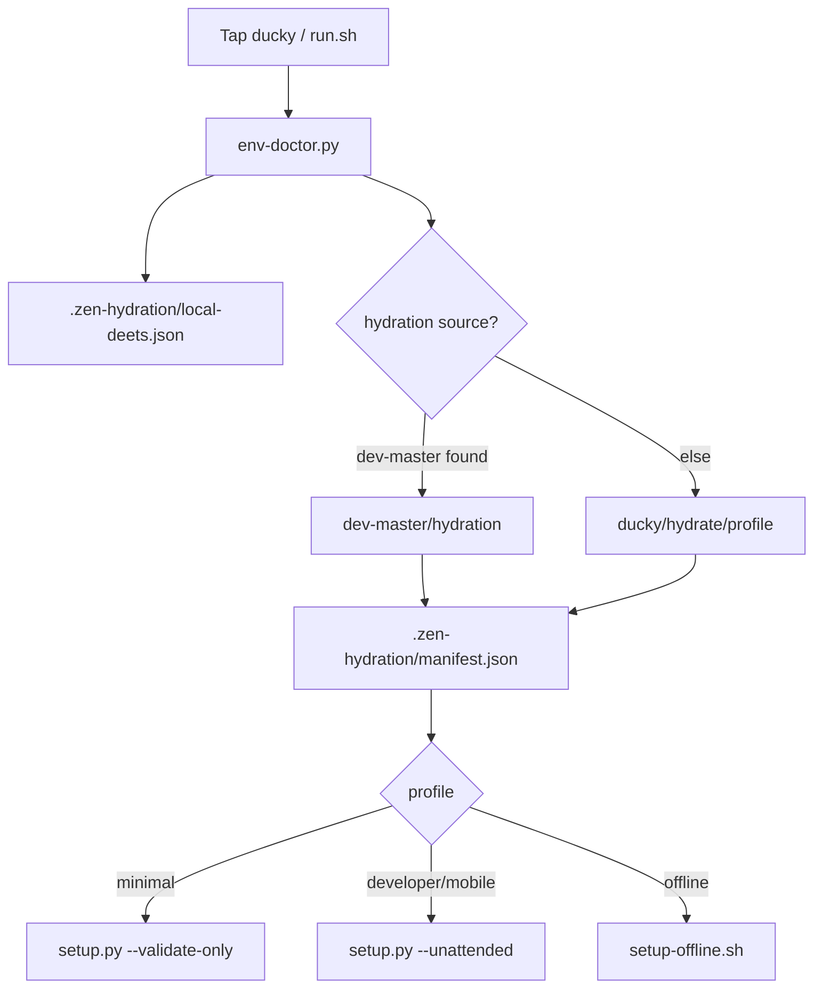

# ZEN-286 — ducky: portable env setup & hydration for zenOS

**Status:** In progress  
**Linear:** https://linear.app/zenos/issue/ZEN-286  
**PR:** Ducks for zenOS quickstart and env dev pipeline and hydration

---

## Problem

zenOS has solid programmatic setup (`setup.py`, Termux installers, `EnvironmentDetector`, `SetupTroubleshooter`) but no **portable, tap-to-run payload** for:

- Android (Termux widget / shared storage / USB OTG)
- USB drives as env config carriers
- A single entry that runs diagnostics then hydrates a local dev scaffold

Operators currently need curl-pipe installers or manual clone + setup steps. There is no unified **env-doctor → hydrate → programmatic fallback** pipeline.

---

## Intent (from PR discussion)

> Tap ducky on Android or a USB drive as env setup and config payload, starting with auto env-doctor run for local deets and hydration scaffold via dev-master if available, zenOS otherwise programmatically.

### User story

**As** a zenOS operator on mobile or air-gapped USB,  
**I want** to tap/run a single ducky entrypoint,  
**So that** my environment is diagnosed, scaffolded, and bootstrapped without memorizing install commands.

### MVP acceptance criteria

- [ ] `ducky/run.sh` works from repo root and USB path on Linux/macOS
- [ ] `ducky/run.ps1` works on Windows
- [ ] `ducky/tap-termux.sh` finds ducky on common Android storage paths
- [ ] `ducky/env_doctor.py` emits `.zen-hydration/local-deets.json` with platform, tooling, and validation summary
- [ ] Hydration prefers `dev-master/hydration` when present, else `ducky/hydrate/*`
- [ ] Fallback runs `python setup.py --unattended` (or `--validate-only` for minimal profile)
- [ ] `.zen-hydration/manifest.json` records profile, source, and timestamp
- [ ] Documentation in `ducky/README.md` and QUICKSTART cross-link

### Non-goals (defer)

- Encrypted secrets on portable media
- Full OTG auto-mount on Android without Termux/file manager
- Creating the external `dev-master` repo (use `zenOS-dev` / `setup.py` until defined)
- Wiring `zen doctor` into main `zen.cli` entry point (separate follow-up)

---

## Architecture



---

## Hydration profiles

| Profile | Use case | Templates | Setup |
|---------|----------|-----------|-------|
| `minimal` | Quick check + `.env` stub | `hydrate/default` | validate-only |
| `developer` | Default dev machine | `hydrate/default` | unattended |
| `mobile` | Termux / Pixel | `hydrate/mobile` | unattended |
| `offline` | No network | `hydrate/default` | setup-offline |

### Scaffold materialized (no secrets committed)

- `.env` — empty key placeholder from `env.template`
- `AGENTS.md` — post-hydration agent instructions
- `workspace/current/` — active work dir
- `agents/local.yaml` — local agent manifest stub
- `integrations/mcp-config.link` — pointer to sibling MCP repo
- `termux-aliases.sh` / widget script (mobile profile)

---

## Existing building blocks (reuse, don't rewrite)

| Component | Location | Role in ducky |
|-----------|----------|---------------|
| Environment detection | `zen/setup/environment_detector.py` | env-doctor platform block |
| Validation | `zen/setup/troubleshooter.py` | env-doctor issues |
| Programmatic setup | `setup.py` → `zen/setup/unified_setup.py` | fallback bootstrap |
| Health check | `zen/cli_v2.py` `doctor` | post-hydration verification |
| Termux install | `scripts/termux-install.sh` | reference for mobile widgets |
| Private dev repo | `scripts/private-dev.sh` → `zenOS-dev` | future dev-master stand-in |

---

## Implementation phases

### Phase 1 — ducky MVP (this PR)

- `ducky/` directory with manifest, env-doctor, run scripts, hydrate templates
- `docs/issues/ZEN-286.md` (this file)

### Phase 2 — dev-master contract

- Define `dev-master` repo URL, `hydration/` tree schema
- Auto-detect + clone if missing (optional `ZEN_DEV_MASTER` override)

### Phase 3 — CLI integration

- `zen env-doctor` alias on main CLI
- Merge `cli_v2 doctor` into `zen.cli`
- QUICKSTART_TERMUX ducky widget section

---

## Test plan

```bash
# env-doctor
python ducky/env_doctor.py
test -f .zen-hydration/local-deets.json

# full pipeline (developer)
bash ducky/run.sh
test -f .zen-hydration/manifest.json
test -f AGENTS.md

# minimal profile
DUCKY_PROFILE=minimal bash ducky/run.sh

# mobile profile (on Termux)
DUCKY_PROFILE=mobile bash ducky/run.sh
```

---

## Open questions

1. **dev-master vs zenOS-dev** — Is `dev-master` a separate repo from `k-dot-greyz/dev-master` on GitHub, or an alias for `zenOS-dev`?
2. **USB layout** — Should the USB root be `ducky/` only or full `zenOS/` clone?
3. **Secrets on media** — Placeholder-only for MVP; encrypted payload later?
