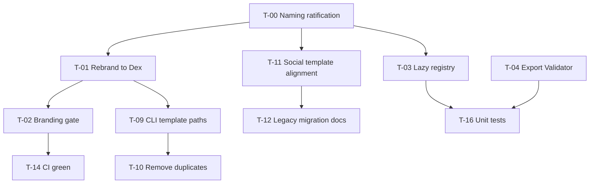

# Template Registry / Dex — Spec Rehydration & PR #18 Post-Mortem

> **Status:** Planning / follow-up to [#18](https://github.com/k-dot-greyz/zenOS/pull/18)  
> **Audience:** Kaspars (greyZ), reviewers, future agents  
> **Last updated:** 2026-08-23  
> **Tone:** constructive roast with receipts — love the ambition, side-eye the archaeology

---

## Vibe check (PR #18, from scratch)

**One-liner:** A fossilized 2025 “Template Pokédex” spec woke up in 2026, shook hands with a half-migrated registry, and tried to board the train while CI was still fixing the tracks.

**What landed well**

- Registry YAML + JSON schemas + evolution metadata — real structure, not vapor.
- `TemplateEngine.render_by_id()` with multi-format rendering — the right primitive.
- `TemplateValidator` multi-pass design (schema → placeholders → metadata → render) — sensible.
- Missing template assets were backfilled after review (standup, social, n8n, boilerplate, registry schema).
- Several CodeRabbit blockers were fixed post-rebase (`jsonschema` API, `__init__` dupes, schema-derived required vars, `env.from_string`).

**What still feels cursed**

- **Branding civil war:** Repo has `scripts/rebrand_to_dex.py` + `tests/test_no_legacy_branding.py` that *forbid* “Pokédex/Pokedex”. PR #18 adds 19+ violations. CI will eat this alive once that test runs in the critical path.
- **Spec drift:** Original intent was “catalog + evolution + analytics for templates.” What shipped is scaffolding + CLI in `dev-master/` that points at `dev-master/templates/` (does not exist) while real assets live at repo-root `templates/`.
- **Runtime foot-gun:** `Agent.__init__` always does `TemplateEngine()` which *requires* `templates/registry.yaml`. Any install without the templates tree breaks core agents — for a feature that should be opt-in.
- **CI still red:** Lint + PR Status Check failing on latest commit (`e0a4bf2`); git checkout `exit 128` noise; Vercel preview failed.
- **Duplicate universe:** `zen/templates/*` and `dev-master/zen/templates/*` are parallel copies. Pick a lane.
- **Review timeout:** CodeRabbit assertive review + unit-test generation timed out at 15min — signal that the diff is too wide for automated review to finish chewing.

**Merge readiness verdict:** **Not merge-ready without rehydration pass.** Treat #18 as a *spike branch* until naming, runtime coupling, paths, tests, and CI are reconciled with current `main` reality.

---

## Rehydrated problem statement (what we were actually trying to build)

### North star

A **Template Dex** (naming per repo policy — not Pokédex) that lets humans and agents:

1. **Discover** templates by id, tags, rarity, and lineage.
2. **Validate** variable payloads against JSON Schema before render.
3. **Render** by registry id across markdown / yaml / jinja / json / workflow assets.
4. **Track evolution** (version history, deprecation, successors) separately from runtime render.
5. **Integrate** with existing zenOS surfaces (`zen` CLI, agents, n8n, legacy `ai_post_templates.yaml`) without breaking installs that omit template assets.

### Non-goals (for v1)

- Full CLI “control center” in `dev-master/` (scaffold only until paths and exports work).
- PR status bot commenting on every sync (needs permissions + dedupe design).
- Pokémon gamification copy in production code (repo explicitly rebranded away from this).

### Success criteria (v1)

| Criterion | Metric |
|-----------|--------|
| Branding gate | `scripts/check_no_legacy_branding.py` → exit 0 |
| Core agents | `Agent()` works when `templates/` absent (lazy/opt-in registry) |
| Registry render | All 5 registry entries render + validate with sample payloads |
| Single source | One package path (`zen/templates/`), no `dev-master` duplicate |
| CI | `zenOS CI` lint + test green on PR branch |
| Tests | `tests/test_template_registry.py` covers engine, validator, dex catalog |

---

## Constructive roast ledger (issues → problem → fix energy)

| # | Roast (kind) | Constructive truth | Target fix |
|---|----------------|-------------------|------------|
| R1 | “You added Pokédex to a repo that literally ships a script to delete Pokédex.” | Branding policy exists and is tested. | Rename to Dex / `DexCatalog`; run rebrand script; update registry copy. |
| R2 | “TemplateEngine now holds the whole runtime hostage for a YAML file.” | `agent.py` imports `TemplateEngine()` unconditionally. | Lazy registry load; `registry_required=False` default for legacy `render()`. |
| R3 | “`dev-master/zen/cli.py` is cosplaying as production CLI.” | `TEMPLATES_ROOT = parents[1]/templates` → `dev-master/templates` (missing). | Wire CLI to repo-root `templates/` or move scaffold under `zen/cli_templates.py`. |
| R4 | “`from zen.templates import TemplateValidator` — bold of you to export a module you forgot to export.” | `__all__` only exports `TemplatePokedex`. | Export `TemplateValidator`; add `__all__` contract test. |
| R5 | “JSON validation for `.json` files unless you name the type something creative like `n8n-workflow`.” | `render_by_id` type switch is too narrow. | Validate by extension + `json`/`json-schema`/`n8n-workflow` family. |
| R6 | “`../secrets.txt` called, it loves your `_read_template_file`.” | Path join without normalization guard. | Resolve path; reject `..` escapes outside `template_dir`. |
| R7 | “PR bot with read-only keys trying to write comments is peak 2025.” | Workflow `pull-requests: read` vs `create_issue_comment`. | `pull-requests: write` or drop comment step. |
| R8 | “Placeholder linter that doesn’t lint placeholders — chef’s kiss.” | Docstring promises unused-placeholder detection; code only lists found ones. | Rename docstring or implement unused detection vs schema properties. |
| R9 | “Two copies of the same module — Schrödinger’s maintenance burden.” | `dev-master/zen/templates` mirrors `zen/templates`. | Delete duplicate or generate one from the other; document single owner. |
| R10 | “Social post schema wants `persona`/`topic`; template still speaks `engineers_log`.” | Legacy migration incomplete. | Align template variables with schema or document mapping layer. |
| R11 | “Zero pytest for the biggest new subsystem. vibes-based engineering.” | No `tests/test_template_registry.py`. | Add focused tests (happy path + missing vars + bad paths). |
| R12 | “`pip install -e .` dies because setup imports the universe.” | Pre-existing packaging smell blocks agent env setup. | Fix `setup.py` / PEP 517 metadata-only build. |

---

## Task board (total: **18 items**)

Legend: `✅` fixed in #18 post-rebase · `🔶` partial · `❌` open · `🚫` blocked on rehydration

### Phase 0 — Rehydrate spec & naming (BLOCKER for merge)

| ID | Task | Status | Depends | Labels |
|----|------|--------|---------|--------|
| T-00 | Ratify **Template Dex** naming vs legacy Pokédex spec docs | ❌ | — | `documentation`, `question` |
| T-01 | Execute rebrand: modules `pokedex.py` → `dex_catalog.py`, classes, registry copy | ❌ | T-00 | `enhancement` |
| T-02 | Verify `check_no_legacy_branding.py` clean tree | ❌ | T-01 | `bug` |

### Phase 1 — Runtime safety & API surface

| ID | Task | Status | Depends | Labels |
|----|------|--------|---------|--------|
| T-03 | Lazy / optional registry load in `TemplateEngine` (don't break `Agent()`) | ❌ | T-00 | `bug` |
| T-04 | Export `TemplateValidator` from `zen.templates` | ❌ | — | `bug` |
| T-05 | Path traversal guard in `_read_template_file` | ❌ | — | `bug`, `help wanted` |
| T-06 | `render_by_id` JSON validation for `json-schema`, `n8n-workflow`, `*.json` | ❌ | — | `enhancement` |
| T-07 | Validator uses `read_template_source()` not `_read_template_file` | ❌ | — | `enhancement` |
| T-08 | Fix `_lint_placeholders` docstring or implement unused detection | ❌ | — | `documentation` |

### Phase 2 — Integration & path hygiene

| ID | Task | Status | Depends | Labels |
|----|------|--------|---------|--------|
| T-09 | Fix `dev-master/zen/cli.py` `TEMPLATES_ROOT` → repo `templates/` | ❌ | T-01 | `bug` |
| T-10 | Collapse `dev-master/zen/templates/*` duplicate into `zen/templates` | ❌ | T-09 | `enhancement` |
| T-11 | Align `social_posts.yaml` with `social_post.json` schema | 🔶 | T-00 | `enhancement` |
| T-12 | Document migration from `ai_post_templates.yaml` + `n8n/zenOS_template_selector.json` | ❌ | T-11 | `documentation` |

### Phase 3 — CI, workflows, packaging

| ID | Task | Status | Depends | Labels |
|----|------|--------|---------|--------|
| T-13 | PR status workflow: `pull-requests: write` or remove comment step | ❌ | — | `bug` |
| T-14 | Fix `zenOS CI` lint failures on #18 branch | 🔶 | T-01 | `bug` |
| T-15 | `pip install -e .` without importing `zen` at build time | ❌ | — | `bug`, `help wanted` |
| T-16 | Add `tests/test_template_registry.py` | ❌ | T-03, T-04 | `enhancement` |

### Phase 4 — PR #18 already addressed (keep for audit trail)

| ID | Task | Status | Notes |
|----|------|--------|-------|
| T-17 | `jsonschema` API fix in validator | ✅ | `json.load` + `check_schema` |
| T-18 | Create missing registry template files (5 assets) | ✅ | Backfilled in rebase commit |
| T-19 | Dedupe `zen/templates/__init__.py` | ✅ | `__all__` export |
| T-20 | Schema-derived required variables | ✅ | `_validate_variables` reads JSON schema |
| T-21 | `env.from_string` for ad-hoc render | ✅ | Custom filters/globals preserved |
| T-22 | Evolution entry for `metadata.registry.schema` | ✅ | `evolution.yaml` |
| T-23 | Daily standup schema tightening | ✅ | `format: date`, `additionalProperties: false` |

**Totals:** 23 tracked items · **7 ✅** · **2 🔶** · **14 ❌** · Phase 0 blocks merge

---

## Dependency graph



---

## Recommended execution order

1. **Pause merge on #18** — label as `help wanted` / draft until Phase 0–1 complete.
2. **Follow-up implementation PR(s)** — split by phase (naming+hardening first, then tests+CI).
3. **Rebase #18** onto follow-up fixes or cherry-pick commits — avoid another 2k-line conflict soup.

---

## Links

| Artifact | URL |
|----------|-----|
| Original PR | https://github.com/k-dot-greyz/zenOS/pull/18 |
| Follow-up planning PR | *(see PR after push)* |
| Phase 0 issue | https://github.com/k-dot-greyz/zenOS/issues/57 |
| Phase 1 issue | https://github.com/k-dot-greyz/zenOS/issues/60 |
| Phase 2 issue | https://github.com/k-dot-greyz/zenOS/issues/58 |
| Phase 3 issue | https://github.com/k-dot-greyz/zenOS/issues/59 |
| Branding gate | `scripts/check_no_legacy_branding.py` |
| Rebrand tooling | `scripts/rebrand_to_dex.py` |
| Registry | `templates/registry.yaml` |

---

## Agent handoff prompt

```
Context: PR #18 template registry spike. Read docs/planning/TEMPLATE_REGISTRY_REHYDRATION.md.
Do NOT merge #18 until T-00..T-05 and T-13..T-16 are addressed.
Start with T-00 naming decision, then T-01 rebrand, then T-03 lazy registry.
Run: python scripts/check_no_legacy_branding.py && pytest tests/test_template_registry.py
```
